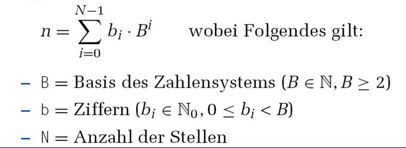

# Zahlendarstellung

Computer koennen nur eine feste Anzahl von Ziffern darstellen ->
die Zahlen haben eine endliche Genauigkeit (nicht alle Nachkommastellen koennen
dargestellt werden)

## Beispiel:

Menge {000, 001, 002, 003, ..., 999}

Mit dieser Menge koennen nich dargestellt werden:
* Zahlen > 999
* Negative Zahlen
* Brueche
* Irrationale Zahlen
* Komplexe Zahlen

Zahlen mit endlicher Genauigkeit sind nicht abgeschlossen
* 600 + 600 = 1200 (zu gross)
* 003 - 005 = -2 (zu klein)
* 050 * 050 = 2500 (zu gross)
* 007 / 002 = 3.5 (keine Ganzzahl)

*Assoziativgesetz*:  
700 + (300 - 400) != (700 + 300) - 400

*Distributivgesetz*:  
10 * (5 / 2) != (10 * 5) / 2

Deshalb -> Aus sich der Mathematiker sind die Ergebnisse bestimmter Berechnungen
schlichtweg *FALSCH*

Im Alltag ist es jedoch normal voellig ausreichend.

---

# Basiszahlensysteme

* Dezimalzahlen (0,1,2,3,4,5,6,7,8,9)
* Binaerzahlen (0,1)
* Oktalzahlen (0,1,2,3,4,5,6,7)
* Hexadezimalzahlen (0,1,2,3,4,5,6,7,8,9,A,B,C,D,E,F)

