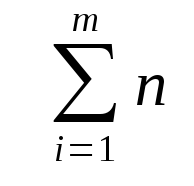

Barnabas Jovanovics

## 1

Namen bestehen aus aneinander gereihten ASCII-Charactern. Es sind nur Buchstaben
von A-Z/a-z und Leerzeichen erlaubt. Die Liste kann zwischen 0 und 100 Namen
enthalten. Die Namen muessen im Format "Vorname Nachname" sein. Wird ein Name
gefunden wird der Boolische Wert True ausgegeben sollte der Name nicht vorhanden
sein wird False ausgegeben.

## 2



```
Integer muliplicate(Integer factor1, Integer factor2)
  Integer result := 0
  while(factor1 > 0) do
    result = result + factor2
    factor1 = factor1 - 1
  end while
  return result
end
```

### Test
```
factor1 = 5
factor2 = 4
result = 0

factor1 = 5 ist groesser als 0
result = 0 + 4 = 4
factor1= 5 - 1 = 4

factor1 = 4 ist 4 ist groesser als 0
result = 4 + 4 = 8
factor1= 4 - 1 = 3

factor1 = 3 ist ist groesser als 0
result = 8 + 4 = 12
factor1= 3 - 1 = 2
 
factor1 = 2 ist groesser als 0
result = 12 + 4 = 16
factor1= 2 - 1 = 1
 
factor1 = 1 ist groesser als 0
result = 16 + 4 = 20
factor1= 1 - 1 = 0

factor1 = 0 ist nicht  groesser als 0

return 20
```
## 3

Es gibt n Anzahl von Spielern, und eine Ausscheidezahl m.
Gib jedem Spieler eine Zahl von 1 bis n und lass sie in einer Reihe von 1 links
bis n rechts in aufsteigeneder Reihenfolge aufstellen. Fange beim Spieler mit
der Nr. 1 an mit 1 zu zaehlen und gehe dann zum naechsten erhoehe dabei dein
Zahl um eins. Wenn deine Zahl Ausscheidezahl m gleich sind lass den Spieler der
an dieser Stelle steht zuruecktreten. Fange beim naechsten Spieler wieder mit 1
an zu Zaehlen. Wenn man den letzten Spieler erreicht hast beginne zaehle wieder
beim ersten Spieler weiter. Wiederhohle das, wobei nur die Spieler gezaehlt
werden die noch vorne stehen, bis nur noch ein spieler uebrig ist. Dieser
Spieler hat gewonnen.

```
n = 7
m = 3

1234567

1234567
1

1234567
 2

  3
12 4567
  3

------

  3
12 4567
   1

  3
12 4567
    2

  3  6
12 45 7
     3 

-------

  3  6
12 45 7
      1

  3  6
12 45 7
2 

 23  6
1  45 7
 3 

-------

 23  6
1  45 7
   1

 23  6
1  45 7
    2

 23  67
1  45 
      3

-------

 23  67
1  45 
1    

 23  67
1  45 
   2 

 23 567
1  4 
    3

-------

 23 567
1  4 
1   

 23 567
1  4 
   2 

123 567
  4 
3   

-------

4 gewinnt
```
