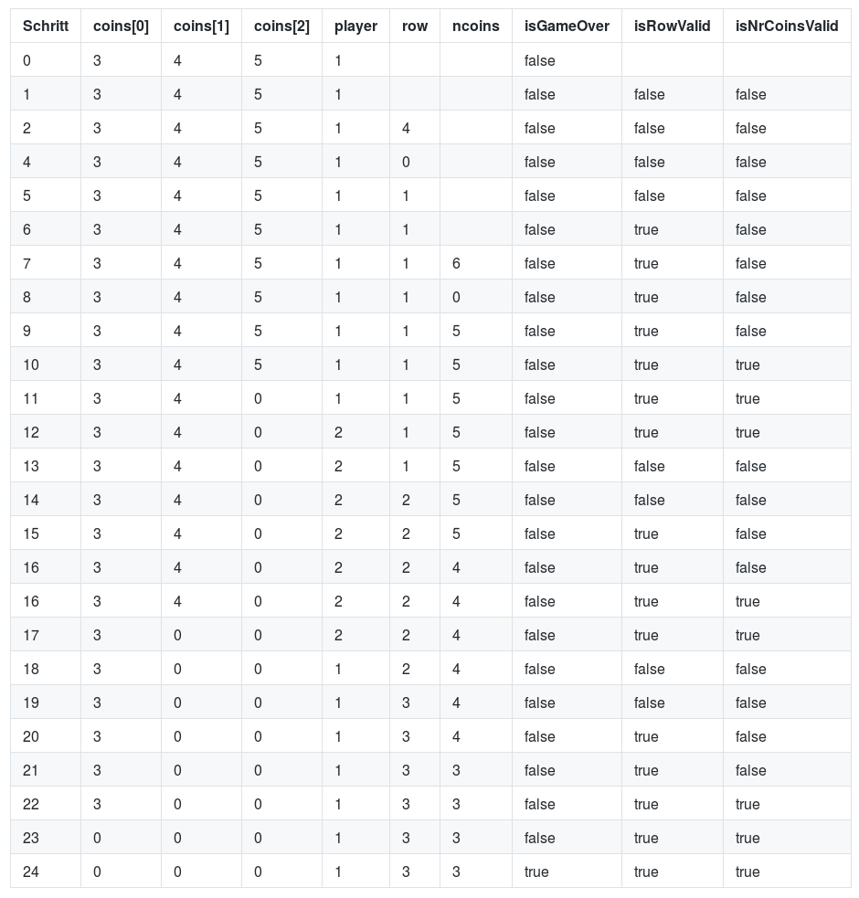

# Aufgabe 1


<div style="page-break-after: always;"></div>


<div style="page-break-after: always;"></div>

## Test 1

| Schritt | x | y | temp | ggT |
|---|---|---|---|---|
| 0 | 44 | 62 |||
| 1 | 44 | 62 |||
| 2 | 62 | 44 |||
| 3 | 62 | 44| 44 ||
| 4 | 62 | 18 | 44 ||
| 5 | 44 | 18 | 44||
| 6 | 44 | 18 | 18 ||
| 7 | 44 | 8 | 18 ||
| 8 | 18 | 8 | 18 ||
| 9 | 18 | 8 | 8 ||
| 10 | 18 | 2 | 8 ||
| 11 | 8 | 2 | 8 ||
| 12 | 8 | 2 | 2 ||
| 13 | 8 | 0 | 2 ||
| 14 | 2 | 0 | 2 ||
| 15 | 2 | 0 | 2 | 2 |

<div style="page-break-after: always;"></div>

## Test 2

| Schritt | x | y | temp | ggT |
|---|---|---|---|---|
| 0  | 7 | 5 |||
| 1  | 7 | 5 | 5 ||
| 2  | 7 | 2 | 5 ||
| 3  | 5 | 2 | 5 ||
| 4  | 5 | 2 | 2 ||
| 5  | 5 | 1 | 2 ||
| 6  | 2 | 1 | 2 ||
| 7  | 2 | 1 | 1 ||
| 8  | 2 | 0 | 1 ||
| 9  | 1 | 0 | 1 ||
| 10 | 1 | 0 | 1 | 1 |

## Test 3

| Schritt | x | y | temp | ggT |
|---|---|---|---|---|
| 0 | 0 | 5  |||
| 1 | 0 | 5 ||-1|

<div style="page-break-after: always;"></div>

# Aufgabe 2
```
isLeapYear(IN Integer year, OUT Boolean result)
  if(((year % 4 == 0) and (year % 100 != 0)) or (year % 400 == 0)) then
    result := true
  else
    result := false
  end if
end
```

| Schritt | year | result |
|---|---|---|
| 0 | 1800 |  |
| 1 | 1800 | false |

| Schritt | year | result |
|---|---|---|
| 0 | 2000 |  |
| 1 | 2000 | true |

| Schritt | year | result |
|---|---|---|
| 0 | 2012 |  |
| 1 | 2012 | true |

<div style="page-break-after: always;"></div>

# Aufgabe 3

```
lastCoinWins(OUT player)
  Integer coins[3] := {3, 4, 5}
  Integer player := 1
  Integer row 
  Integer ncoins 
  Boolean isGameOver := false
  Boolean isRowValid 
  Boolean isNrCoinsValid

  while (not isGameOver) do

    -- reset Valid input every round
    isRowValid := false
    isNrCoinsValid := false
    
    -- get User Input
    while (not isRowValid) do
      -- get row from User
      row = getIntFromUser

      if (row >= 1 && row <= 3) then
        if (coins[3 - row] != 0) then
          isRowValid := true

          while (not isNrCoinsValid) do
            ncoins = getIntFromUser

            if (ncoins <= coins[3 - row] && ncoins > 0) then
              isNrCoinsValid := true;
              coins[3 - row] = coins[3 - row] - ncoins;
            end if
          end while
        end if
      end if
    end while

    -- Check if game is over
    if (coins[0] == 0 && coins[1] == 0 && coins[2] == 0) then
      isGameOver := true;

    -- If not the it's the other players turn
    else 
      player = player + 1;
      if (player > 2) then
        player = 1;
      end if
    end if
  end while
end lastCoinWins
```

<div style="page-break-after: always;"></div>


