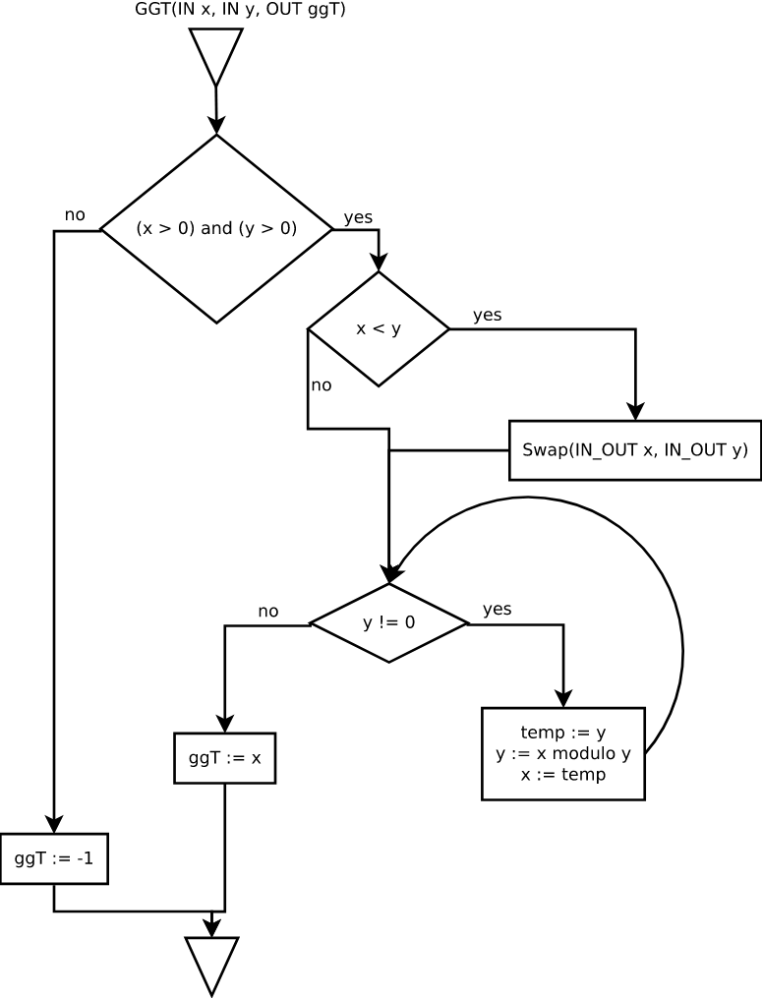
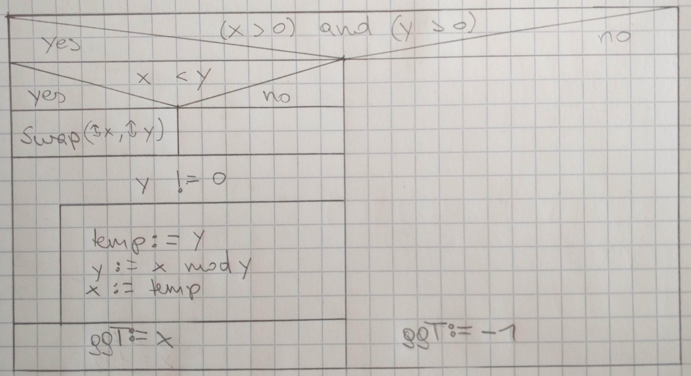

# Aufgabe 1




## Test 1

| Schritt | x | y | temp | ggT |
|---|---|---|---|---|
| 0 | 44 | 62 |||
| 1 | 44 | 62 |||
| 2 | 62 | 44 |||
| 3 | 62 | 44| 44 ||
| 4 | 62 | 18 | 44 ||
| 5 | 44 | 18 | 44||
| 6 | 44 | 18 | 18 ||
| 7 | 44 | 8 | 18 ||
| 8 | 18 | 8 | 18 ||
| 9 | 18 | 8 | 8 ||
| 10 | 18 | 2 | 8 ||
| 11 | 8 | 2 | 8 ||
| 12 | 8 | 2 | 2 ||
| 13 | 8 | 0 | 2 ||
| 14 | 2 | 0 | 2 ||
| 15 | 2 | 0 | 2 | 2 |

## Test 2

| Schritt | x | y | temp | ggT |
|---|---|---|---|---|
| 0  | 7 | 5 |||
| 1  | 7 | 5 | 5 ||
| 2  | 7 | 2 | 5 ||
| 3  | 5 | 2 | 5 ||
| 4  | 5 | 2 | 2 ||
| 5  | 5 | 1 | 2 ||
| 6  | 2 | 1 | 2 ||
| 7  | 2 | 1 | 1 ||
| 8  | 2 | 0 | 1 ||
| 9  | 1 | 0 | 1 ||
| 10 | 1 | 0 | 1 | 1 |

## Test 3

| Schritt | x | y | temp | ggT |
|---|---|---|---|---|
| 0 | 0 | 5  |||
| 1 | 0 | 5 ||-1|

# Aufgabe 2
```
isLeapYear(IN Integer year, OUT Boolean result)
  if(((year % 4 == 0) and (year % 100 != 0)) or (year % 400 == 0)) then
    result := true
  else
    result := false
  end if
end
```

| Schritt | year | result |
|---|---|---|
| 0 | 1800 |  |
| 1 | 1800 | false |

| Schritt | year | result |
|---|---|---|
| 0 | 2000 |  |
| 1 | 2000 | true |

| Schritt | year | result |
|---|---|---|
| 0 | 2012 |  |
| 1 | 2012 | true |

# Aufgabe 3

```
lastCoinWins(OUT player)
  Integer coins[3] := {3, 4, 5}
  Integer player := 1
  Integer row 
  Integer ncoins 
  Boolean isGameOver := false
  Boolean isRowValid 
  Boolean isNrCoinsValid

  while (not isGameOver) do

    -- reset Valid input every round
    isRowValid := false
    isNrCoinsValid := false
    
    -- get User Input
    while (not isRowValid) do
      -- get row from User
      row = getIntFromUser

      if (row >= 1 && row <= 3) then
        if (coins[3 - row] != 0) then
          isRowValid := true

          while (not isNrCoinsValid) do
            ncoins = getIntFromUser

            if (ncoins <= coins[3 - row] && ncoins > 0) then
              isNrCoinsValid := true;
              coins[3 - row] = coins[3 - row] - ncoins;
            end if
          end while
        end if
      end if
    end while

    -- Check if game is over
    if (coins[0] == 0 && coins[1] == 0 && coins[2] == 0) then
      isGameOver := true;

    -- If not the it's the other players turn
    else 
      player = player + 1;
      if (player > 2) then
        player = 1;
      end if
    end if
  end while
end lastCoinWins
```

| Schritt | coins[0] | coins[1] | coins[2] | player | row | ncoins | isGameOver | isRowValid | isNrCoinsValid|
|---|---|---|---|---|---|---|---|---|---|
|0| 3 | 4 | 5 | 1 | | | false | | |
|1|3|4|5|1|||false|false|false|
|2|3|4|5|1|4||false|false|false|
|4|3|4|5|1|0||false|false|false|
|5|3|4|5|1|1||false|false|false|
|6|3|4|5|1|1||false|true|false|
|7|3|4|5|1|1|6|false|true|false|
|8|3|4|5|1|1|0|false|true|false|
|9|3|4|5|1|1|5|false|true|false|
|10|3|4|5|1|1|5|false|true|true|
|11|3|4|0|1|1|5|false|true|true|
|12|3|4|0|2|1|5|false|true|true|
|13|3|4|0|2|1|5|false|false|false|
|14|3|4|0|2|2|5|false|false|false|
|15|3|4|0|2|2|5|false|true|false|
|16|3|4|0|2|2|4|false|true|false|
|16|3|4|0|2|2|4|false|true|true|
|17|3|0|0|2|2|4|false|true|true|
|18|3|0|0|1|2|4|false|false|false|
|19|3|0|0|1|3|4|false|false|false|
|20|3|0|0|1|3|4|false|true|false|
|21|3|0|0|1|3|3|false|true|false|
|22|3|0|0|1|3|3|false|true|true|
|23|0|0|0|1|3|3|false|true|true|
|24|0|0|0|1|3|3|true|true|true|
