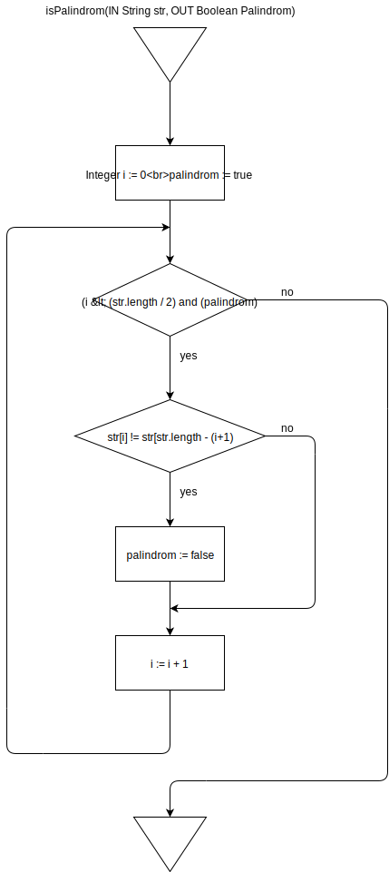

# Aufgabe 1 (Palindrom)

*Loesungsidee*: Ich vergleiche denn ersten und letzten Buchstaben und arbeite
mich von dort in die Mitte


<div style="page-break-after: always;"></div>


<div style="page-break-after: always;"></div>

```
isPalindrom(IN String str, OUT Boolean palindrom)
  Integer i := 0
  palindrom := true

  while((i < (str.length/2)) and (palindrom)) do   
    if(str[i] != str[str.length - (i + 1)) then
      palindrom := false
    end if
      i := i + 1
  end while
end isPalindrom
```

str := "ROTOR"

|Zeile|str[i]|str[str.length - (i+1)]|i|palindrom|
|---|---|---|---|---|
|2,3|||0|true|
|6|R|R|0|true|
|9|R|R|1|true|
|6|O|O|1|true|
|9|O|O|2|true|

str := "REITTIER"

|Zeile|str[i]|str[str.length - (i+1)]|i|palindrom|
|---|---|---|---|---|
|2,3|||0|true|
|6|R|R|0|true|
|9|R|R|1|true|
|6|E|E|1|true|
|9|E|E|2|true|
|6|I|I|2|true|
|9|I|I|3|true|
|6|T|T|3|true|
|9|T|T|4|true|

str := "BARNABAS"

|Zeile|str[i]|str[str.length - (i+1)]|i|palindrom|
|---|---|---|---|---|
|2,3|||0|true|
|6|B|S|0|true|
|7|B|S|0|false|
|9|B|S|1|false|

# Aufgabe 2 Haeufigkeitsanalyse

*Loesungsidee*: Ich zaehle zuerst alle Buchstaben in einem Array wobei ich den
ASCII wert als index fuer die jeweiligen Buchstaben nehme. Anschliessend lege
ich die gesuchten Werte auf die Ausgangsparameter um.

```
VowelOccurencies(IN String text, OUT Real freqA, OUT Real freqE, OUT Real freqI, OUT Real freqO, OUT Real freqU) 
  Integer i := 0
  Integer[] letterCount[256] := {0}
  freqA = 0.0 
  freqE = 0.0 
  freqI = 0.0 
  freqO = 0.0 
  freqU = 0.0 
    
  while(i < text.length) do
    letterCount[text[i]] := letterCount[text[i]] + 1
    i := i + 1
  end while

  if(text.length > 0) then
    freqA = ((lettercount['A'] + letterCount['a']) * 100.0) / text.length
    freqE = ((lettercount['E'] + letterCount['e']) * 100.0) / text.length
    freqI = ((lettercount['I'] + letterCount['i']) * 100.0) / text.length
    freqO = ((lettercount['O'] + letterCount['o']) * 100.0) / text.length
    freqU = ((lettercount['U'] + letterCount['u']) * 100.0) / text.length
  end if
end VowelOccurencies
```

text := "Heute ist ein schoener Tag"

|Zeile|i|text[i]|letterCount[text[i]|freqA|freqE|freqI|freqO|freqU|
|---|---|---|---|---|---|---|---|---|
|2-8|0|||0.0|0.0|0.0|0.0|0.0|
|11,12|1|'H'|1|0.0|0.0|0.0|0.0|0.0|
|11,12|2|'e'|1|0.0|0.0|0.0|0.0|0.0|
|11,12|3|'u'|1|0.0|0.0|0.0|0.0|0.0|
|11,12|4|'t'|1|0.0|0.0|0.0|0.0|0.0|
|11,12|5|'e'|2|0.0|0.0|0.0|0.0|0.0|
|11,12|6|' '|1|0.0|0.0|0.0|0.0|0.0|
|11,12|7|'i'|1|0.0|0.0|0.0|0.0|0.0|
|11,12|8|'s'|1|0.0|0.0|0.0|0.0|0.0|
|11,12|9|'t'|2|0.0|0.0|0.0|0.0|0.0|
|11,12|10|' '|2|0.0|0.0|0.0|0.0|0.0|
|11,12|11|'e'|3|0.0|0.0|0.0|0.0|0.0|
|11,12|12|'i'|2|0.0|0.0|0.0|0.0|0.0|
|11,12|13|'n'|1|0.0|0.0|0.0|0.0|0.0|
|11,12|14|' '|3|0.0|0.0|0.0|0.0|0.0|
|11,12|15|'s'|2|0.0|0.0|0.0|0.0|0.0|
|11,12|16|'c'|1|0.0|0.0|0.0|0.0|0.0|
|11,12|17|'h'|1|0.0|0.0|0.0|0.0|0.0|
|11,12|18|'o'|1|0.0|0.0|0.0|0.0|0.0|
|11,12|19|'e'|4|0.0|0.0|0.0|0.0|0.0|
|11,12|20|'n'|2|0.0|0.0|0.0|0.0|0.0|
|11,12|21|'e'|5|0.0|0.0|0.0|0.0|0.0|
|11,12|22|'r'|1|0.0|0.0|0.0|0.0|0.0|
|11,12|23|' '|4|0.0|0.0|0.0|0.0|0.0|
|11,12|24|'T'|1|0.0|0.0|0.0|0.0|0.0|
|11,12|25|'a'|1|0.0|0.0|0.0|0.0|0.0|
|11,12|26|'g'|1|0.0|0.0|0.0|0.0|0.0|
|16|26|||3.846|0.0|0.0|0.0|0.0|
|17|26|||3.846|19.2301|0.0|0.0|0.0|
|18|26|||3.846|19.2301|7.692|0.0|0.0|
|19|26|||3.846|19.2301|7.692|3.846|0.0|
|20|26|||3.846|19.2301|7.692|3.846|3.846|

# Aufgabe 3 Bauernmultiplikation

```
bauernmultiplikation(IN Integer factor1, IN Integer factor2, OUT Integer product)
  product := 0
  while(factor1 > 0) do
    if ((factor1 mod 2) == 1) then
      product := product + factor2
    end if
    factor1 := factor1 / 2
    factor2 := factor2 * 2
  end while
end bauernmultiplikation
```

factor1 := 5  
factor2 := 6

|Zeile|factor1|factor2|product|
|---|---|---|---|
|2|5||6|0|
|5|5|6|6|
|13,14|2|12|6|
|13,14|1|24|6|
|5|1|24|30|
|13,14|0|48|30|
